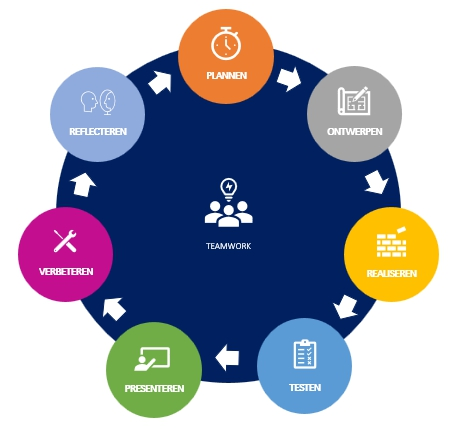

# Challenge - Portfolio

## Wat is een challenge?

Het is een hele stap om van leren naar toepassen te gaan. Waar het in de modules gaat om het aanleren van kennis en vaardigheden, gaat het er in een challenge om deze toe te passen in een prakijksituatie. Om een challenge goed af te ronden moet je dus de stof uit modules beheersen. Daarnaast is een challenge een manier om te laten zien wat je allemaal al kan!

In volgende challenges zal er steeds meer nadruk liggen op samenwerken en zal je steeds meer vrij gelaten worden in de manier waarop je invulling geeft aan de opdracht. Deze eerste keer doen we echter een individuele challenge en je zal voor een groot deel worden begeleidt in de te volgen stappen.

## Waarom doen we een Challenge?

Tot nu toe heb je veel kleine oefeningen gedaan in de vorm van de taken die bij een module horen. Aan het eind van elke module was de eindopdracht bedoeld om je alle stof van een module nog een keer te oefenen in een grotere opdracht. In een challenge is het de bedoeling dat je een nog groter probleem oplost met kennis en kunde zoals je die in een aantal modules hebt geleerd. 

Een challenge is bedoeld om je uit te dagen, om je te laten omgaan met het zelf oplossen van problemen door op zoek te gaan naar goede bronnen en vooral ook om je te laten wennen hoe je straks in het werkveld aan de slag zal gaan. Een challenge is niet zomaar een opdracht om af te vinken maar een kans om te shinen en al je creativiteit en kunde in te stoppen.

## Modules

Om deze challenge succesvol af te kunnen ronden, is het belangrijk dat je de stof uit onderstaande modules beheerst.

:star: Devops  
:star: Frontend-Basic  
:star: Frontend-Essentials  
:star: Denken Als een Programmeur 1  
:star: Denken Als een Programmeur 2  

## Inleiding challenge Portfolio

In de module Frontend-Basic heb je als eindopdracht een begin gemaakt aan een online portfolio. Nu je meer kennis hebt van HTML/CSS en Javascript kun je deze verder uitwerken tot een echt portfolio.

> Wat is een portfolio en waar wordt dit voor gebruikt? Zie [Wikipedia.nl - Portfolio](https://nl.wikipedia.org/wiki/Portfolio).

Als Software Ontwikkelaar zal een groot deel van je werk te zien op je persoonlijke Github account. Een geïnteresseerde werkgever of stagebegeleider kan aan jou code zien wat je allemaal kan. Toch is het ook fijn als zo iemand jou een beetje beter leert kennen, op persoonlijk én professioneel vlak. In deze Challenge ga je een eigen portfolio ontwerpen en deze live zetten via Github Pages. Zo heb je een plek online die je kan delen met geintereseerden en straks ook met stagebedrijven en/of potentiele werkgevers!

Gedurende de opleiding zal je je portfolio verder updaten met nieuwe projecten en zal je nieuwe technieken die je leert kunnen gebruiken om je portfolio bij te werken. 

## Werkwijze Challenge

### De 7 stappen van Software Development

In bovenstaand plaatje is te zien welke stappen je tijdens de Challenge gaat doorlopen. Je begint bovenaan met het onderdeel Plannen en gaat dan met de klok mee tot je de Challenge hebt afgerond. 

Omdat je veel van deze stappen voor de eerste keer zal uitvoeren is het logisch dat je niet in één keer een perfecte uitwerking per stap oplevert. Het doel is dat je steeds beter wordt in de verschillende stappen. Als je dus tijdens de `Realisatie` stap merkt dat je iets vergeten bent op te nemen in je planning dan **voeg je dit alsnog toe**. Hetzelfde geldt voor de andere stappen. Uiteindelijk leer je zo steeds beter wat er allemaal komt kijken bij het uitwerken van een echt project zoals je dat straks in het beroepsveld ook zult gaan doen.

> :warning: **LETOP**: Als je iets update maak dan een nieuwe commit aan. Zo kun je later zien hoe een bepaalde document is gegroeid en heeft het docententeam inzicht in je werkwijze.

> :rocket: **TIP**: Je zult in deze Challenge documenten opleveren in het [Markdown](https://guides.github.com/features/mastering-markdown/) formaat. Dit is hetzelfde formaat als waar de uitleg bij de modules wordt geschreven. Check de link om te lezen hoe Markdown werkt en hoe je als je dat wilt de documenten anders kan vormgeven.

### Eindresultaat

1. **:clock1: Stap 1 - Plannen**
   - zie :scroll:[README](01-Challenge/Taak01-Plannen/README.md)
   - Een Planning uitgewerkt in het :pencil2:[`student-planning.md`](01-Challenge/Taak01-Plannen/student-planning.md) Markdown document
2. **:art: Stap 2 - Ontwerpen**
   - zie :scroll:[README](01-Challenge/Taak02-Ontwerpen/README.md)
   - Een boomstructuur uitgewerkt in :art:[student-boomstructuur.drawio.png](01-Challenge/Taak02-Ontwerpen/student-boomstructuur.drawio.png)
   - Een wireframe uitgewerkt in :art:[student-wireframe.drawio.png](01-Challenge/Taak02-Ontwerpen/student-wireframe.drawio.png)
3. **:construction: Stap 3 - Realiseren**
   - zie :scroll:[README](01-Challenge/Taak03-Realiseren/README.md)
   - Een Portfolio website uitgewerkt in de `portfolio` map en live gezet via Github Pages. Zie de [`Technische Eisen`](01-Challenge/Taak03-Realiseren/technische-eisen.md).
4. **:clipboard: Stap 4 - Testen**
   - zie :scroll:[README](01-Challenge/Taak04-Testen/README.md)
   - Een lijst met issues uitgewerkt in :pencil2:[`student-issues.md`](01-Challenge/Taak04-Testen/student-issues.md)
5. **:chart_with_upwards_trend: Stap 5 - Presenteren**
   - zie :scroll:[README](01-Challenge/Taak05-Presenteren/README.md)
   - Een lijst met feedback punten uitgewerkt in :pencil2:[`student-feedback.md`](01-Challenge/Taak05-Presenteren/student-feedback.md)
6. **:white_check_mark: Stap 6 - Verbeteren**
   - zie :scroll:[README](01-Challenge/Taak06-Verbeteren/README.md)
   - Een lijst met punten die je verbetered hebt uitgewerkt in :pencil2:[`student-changes.md`](01-Challenge/Taak06-Verbeteren/student-changes.md) 
7. **:thought_balloon: Stap 7 - Reflecteren**
   - zie :scroll:[README](01-Challenge/Taak07-Reflecteren/README.md)
   - Een kort verslag waarin je reflecteerd op je eigen werk en process tijdens deze Challenge uitgewerkt in :pencil2:[`student-reflectie.md`](01-Challenge/Taak07-Reflecteren/student-reflectie.md)
------
8. **:speech_balloon: Stap 08 - Eindgesprek**
   - zie :scroll:[README](01-Challenge/Taak08-Eindgesprek/README.md)◙
